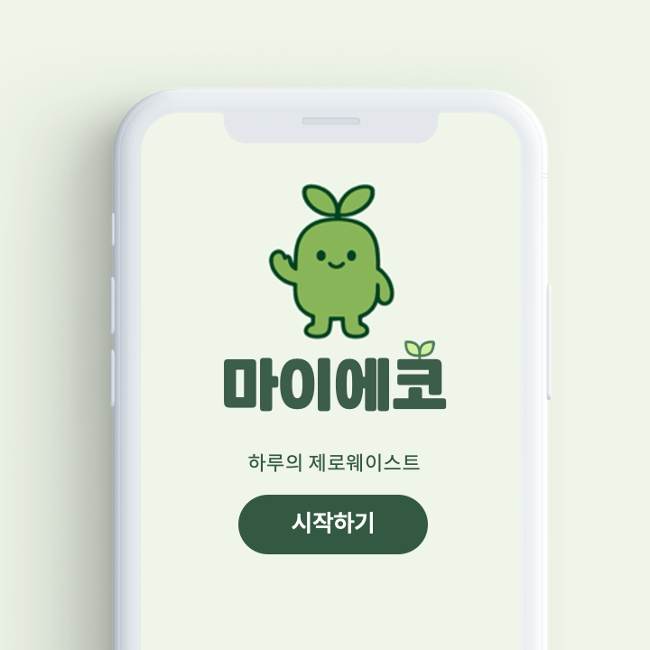

# 마이에코
### 누구나 일상에서 쉽게 실천할 수 있는 제로웨이스트 습관형성 서비스



---

## Project Overview
### 프로젝트 소개

**목표**

1. 하루 흐름에 맞춘 리마인드 기능으로 필요한 순간에 실천을 자연스럽게 떠올려 실천할 수 있게 합니다.
2. 누구나 바로 따라할 수 있는 쉬운 행동을 제안해 실천을 쉽게 시작할 수 있게 합니다.
3. 실천 기록을 효과적으로 시각화하여, 사용자가 성취감을 느끼고 계속 실천할 수 있게 합니다.


**주요 기능**

**1. 알림 기능:** 깜빡하기 쉬운 텀블러, 장바구니 챙기기 등의 제로웨이스트 습관을 설정한 알림이 울리며 리마인드 시킬 수 있습니다.
**2. 제로웨이스트 미션:** 잘 몰랐지만 일상에서 쉽게 할 수 있는 제로웨이스트 미션을 매일 3가지씩 추천해줍니다.
**3. 캘린더:** 그날의 제로웨이스트 미션 실천율에 따라 3단계로 색상을 구분하여 캘린더 색상을 통해 미션 수행 연속일을 확인하는 기능입니다.
**4. 마이 페이지:** 사용자가 그동안 쌓아온 환경 실천을 한 눈에 확인하고, 누적 기여도를 시각적으로 체감할 수 있는 기능입니다. 

---

## Project Outcome
### 프로젝트 결과

**목적**

- 제로웨이스트 활동을 실천하기 원하지만 실천하기 어려운 사람들을 위해서 습관을 만들어나가는 것을 보조하기 위한 앱으로 제작되었습니다.

**기대 효과**

- 습관 형성 및 루틴화: 개인화된 커스텀 알림을 통해 제로웨이스트 실천을 루틴화 가능하게 할 수 있습니다.
- 진입 장벽 완화: 일상에서 쉽게 할 수 있는 제로웨이스트 미션 추천으로 제로웨이스트 실천의 '시작'을 보조할 수 있습니다.
- 강력한 내적 동기 부여: 환경 영향 리포트 및 캘린더를 통해 내 행동이 만드는 변화를 수치/시각화로 확인 가능하여 성취감과 자기효능감이 증가합니다.


**서비스 확장 가능성**

- 커뮤니티 및 소셜 기능 강화: '팀 미션' 기능 도입하여 사용자 간 챌린지 수행 기능을 강화할 수 있습니다. 타인의 리포트에 반응을 남기는 기능을 통해 지속 실천율 향상을 가능하게 할 수 있습니다.
- 데이터 기반 개인화 고도화: 사용자의 실천 패턴을 분석한 더욱 정교한 미션 추천이 가능해질 수 있습니다. 위치 및 어플 사용 데이터 기반 알림 서비스 기능 확대도 가능할 수 있습니다.
- 서비스 확장성과 지속 가능성 확보: ESG 실천 캠페인과 연계하여 기업과의 B2B 확대 및 지역 단위 환경 정책과 연계사업을 추진할 수 있습니다.

---

## Installation Guide
### 설치 및 실행
**해당 깃허브 레퍼지토리는 웹버전 깃허브 링크입니다.**

**App Download 앱 다운로드**

- 앱 다운 링크 : (https://drive.google.com/drive/folders/1IQFCdABnKx9wUy-c2g2pKIupIqs5BNGL?usp=drive_link)

**1. 안드로이드 기기로 구글 드라이브 링크 열기**
**2. 안드로이드 기기에 마이에코.apk 파일 저장**
**3. 안드로이드 기기 파일 앱에 들어가 apk 파일 설치**
**4. 로그인 화면에서 이메일과 비밀번호 설정 후 서비스 시작**

**Web Version Link 웹 버전 링크**
- 웹 링크 : (https://bottle-web-working.vercel.app/)

**1. 링크 클릭하기**
**2. 로그인 화면에서 이메일과 비밀번호 설정 후 서비스 시작**

**Run on Local Environment 로컬 환경에서 실행**
**알림 기능은 데스크탑 웹에서 확인 가능(모바일 웹에선 불가)**

1. 리포지토리 클론하기
```bash
git clone https://github.com/Hyoso0w0/bottle_web_working.git
```

2. 폴더로 이동
```bash
cd bottle_web_working
```

3. 디펜던시 다운로드하기
```bash
npm install --global expo-cli
```

4. Expo-go 실행
```bash
npx expo start
```

5. 휴대전화 기기에 Expo-go 앱 다운로드

6. 휴대전화로 터미널에서 생성된 QR 코드 스캔

---

## Project Structure
### 프로젝트 구조

```plaintext
bottle_web_working/
├── assets/
├── data/
├── utils/
├── App.js
├── AppContext.js
├── CumulativeReportScreen.js
├── firebase.js
├── firestoreHelpers.js
├── google-services.js
├── HomeScreen.js
├── index.js
├── LevelSection.js
├── localNotifications.js
├── LoginScreen.js
├── NotificationsScreen.js
├── RecordsScreen.js
├── ReportScreen.js
├── StartScreen.js
├── WeekDaySelect.js
```

---

## Fellow & Mentor
### 펠로우 및 멘토
**Fellow 펠로우**
- 보틀 팩토리 정다운 펠로우님
- [Bottle Factory Website](https://www.bottlefactory.co.kr/)

**Mentor 멘토**
- 카카오 장아영 멘토님

---

## Development Environment
### 개발 환경

### Frontend 프론트엔드
JavaScript, HTML, ReactNative, Expo-Go, Favicon (UI asset), Feather (UI asset) 

### Backend 백엔드
JavaScript, HTML, ReactNative, Expo-Go, Firebase, Android Studio

## Version Management
### 버전 관리
- **Git branch:** 개별 브랜치에서 개발 후 PR을 통해 버전 관리.
- **GitHub Desktop:** 깃허브 데스크탑을 통해 pull, push, commit 등을 실행함.

## Collaboration & Communication Tools 
### 협업 및 소통 
- **일정 관리:** 노션(Notion)캘린더 및 카카오톡 그룹챗을 통한 일정 관리
- **이슈 관리:** 노션(Notion)과 구글 드라이브(Google Drive) 기반으로 이슈 관리

---

## Team Members
### 팀원 소개

| 이름 | 역할 | 학과     |
|------|------|----------|
| 김재연 | 기획 | 사회교육과 |
| 김효주 | 개발 | 의류학과 |
| 이다혜 | 기획 | 역사교육과 |
| 최정원 | 개발 | 영어영문학과 |
| 최환 | 기획, 팀장 | 공예학과 |
